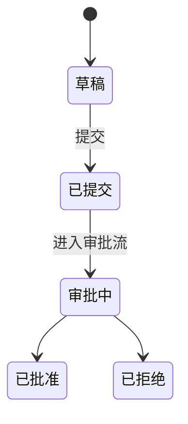

# 信贷管理系统 Wiki 生成手册（OpenCode 内网执行版）

> 用途：把本文件放进信贷系统**代码仓库根目录**，在内网用 OpenCode 按本手册执行。
> 目标：让后续 Agent 拿到一条需求时，能① 看懂业务专有名词 → ② 翻译成代码符号 → ③ 定位到要改的文件 → ④ 知道改什么、会影响什么。
> 一切结论必须来自代码，禁止臆造。

---

## 0. 一句话启动（直接粘进 OpenCode）

```
你现在的任务：通读本仓库的信贷管理系统代码，按仓库根目录的《信贷系统Wiki生成手册-OpenCode执行版.md》分阶段执行，生成面向"需求分析 Agent"的文档体系。
强约束：
1) 所有结论必须有代码出处，格式标注为 `文件路径:行号` 或 `类名/方法名`；读不懂或不确定的，标 `【存疑/TODO】` 而不是编造。
2) 严格按手册的阶段顺序执行，每个阶段产出对应文件后再进入下一阶段，避免上下文过载。
3) 输出全部用中文；业务术语保留代码中的原始命名（表名/类名/字段名/枚举值不要翻译）。
现在从 Phase 0 开始。
```

---

## 1. 最终产出物清单与摆放位置

按 OpenCode 的加载机制摆放（根 `AGENTS.md` 自动加载；子目录 `AGENTS.md` 就近加载；`docs/` 为深度参考，按需检索）。

```
仓库根/
├── AGENTS.md                      # 导航中枢，<200 行，OpenCode 启动即读
├── docs/
│   ├── 00-索引.md                 # 全部文档入口与阅读指引
│   ├── 01-系统概览.md             # 技术栈/分层/部署/外部依赖
│   ├── 02-业务全景.md             # 贷前/贷中/贷后全流程 + 角色权限
│   ├── glossary.md                # ★术语词典（专治黑话，最重要）
│   ├── capability-map.md          # ★能力地图（需求落点：能力→文件→表/接口）
│   ├── data-model.md              # 核心实体/表/ER/枚举字典
│   ├── sql-logic.md               # ★SQL/存储过程/批处理/报表口径
│   ├── workflow-templates.md      # ★工作流/审批流模板（节点/分支/审批人）
│   ├── api-list.md                # 对外接口与集成点清单
│   └── modules/
│       ├── 客户管理.md
│       ├── 授信申请.md
│       ├── 风险评估.md
│       ├── 审批流.md
│       ├── 合同管理.md
│       ├── 放款.md
│       ├── 额度管理.md
│       ├── 账务核算.md
│       ├── 贷后监控.md
│       ├── 预警催收.md
│       ├── 担保押品.md
│       └── 报表.md
└── <各核心模块代码目录>/AGENTS.md  # 模块级局部规则，100–200 行
```

> 注：`modules/` 下的清单是**信贷系统典型模块**，OpenCode 应以**代码实际划分**为准增删，不要硬套。

---

## 2. 通用执行原则（贯穿所有阶段）

1. **代码即唯一事实来源**：业务含义优先从实体名、字段名、枚举、注释、校验规则、状态机、SQL/Mapper、接口定义中推断；其次参考 README/配置。每条关键结论都要带出处。
2. **保留原始命名**：`CreditLimit`、`risk_level`、`STATUS_REJECTED` 这类符号原样保留，词典里再给中文释义，这样 Agent 才能在代码里 grep 到。
3. **不确定就标记**：拿不准的业务含义写 `【存疑：依据 xxx 推断，需业务确认】`，绝不编造。
4. **分阶段、可中断**：每个 Phase 独立产出文件，互不阻塞上下文。大仓库可按模块分批跑同一 Phase。
5. **面向"改需求"写**：每个模块文档都要回答——这块功能的入口在哪、核心流程怎么走、动它会牵连哪些表/接口/模块。
6. **可追溯**：术语、能力、模块三份索引之间用一致的符号互相引用，形成 闭环（术语→能力→文件）。

---

## 3. 分阶段执行指令（逐段粘贴或整体交给 OpenCode）

### Phase 0 — 侦察与盘点
**指令：**
```
扫描整个仓库，产出 docs/00-索引.md 的草稿与一份内部盘点，包含：
- 技术栈与框架（语言、Web 框架、ORM/持久层、工作流引擎、规则引擎、消息中间件、定时任务等），各给 1 个代码出处。
- 顶层目录树（2–3 层）并标注每个目录的职责猜测。
- 构建/运行/测试命令（从构建文件、脚本、CI 配置中找）。
- 模块边界识别：按包结构/目录/服务划分，列出候选业务模块清单，并与第 1 节的典型模块做映射（哪些有、哪些没有、哪些命名不同）。
先不要写业务细节，本阶段只交付"地图"。
```
**产出：** `docs/00-索引.md`、`docs/01-系统概览.md`（技术栈与架构部分先成型）。

### Phase 1 — 数据模型抽取（业务语义的根）
**指令：**
```
抽取核心数据模型，产出 docs/data-model.md：
- 找出所有实体/表（JPA/MyBatis 实体、DDL、建表脚本、Mapper XML）。
- 每张核心表：业务含义、关键字段（名+类型+含义）、主外键关系、所属模块。
- 枚举/字典：把所有状态码、类型码、标志位整理成"字典表"（代码值 → 含义），尤其是状态机相关枚举。
- 给出核心实体的 ER 关系（用 Mermaid erDiagram 或文字描述）。
字段含义不清的标【存疑】。这一步的枚举字典将直接喂给 Phase 2 的术语词典。
```
**产出：** `docs/data-model.md`。

### Phase 1B — MyBatis SQL 逻辑抽取（★业务规则常藏在 Mapper 里）
> 本系统以 MyBatis 为主，重点是 Mapper XML 里的动态 SQL，而非存储过程。
**指令：**
```
抽取 MyBatis 中的业务逻辑，产出 docs/sql-logic.md：
1. 先盘点所有 Mapper XML（resources/mapper/** 或 *Mapper.xml）与对应 Mapper 接口，建一张"Mapper → 主表 → 所属模块"对照表。
2. 动态 SQL 分支（核心）：逐个 <if>/<choose>/<when>/<where>/<trim>/<foreach> 把条件翻译成业务含义。
   例：`<if test="riskLevel != null and riskLevel >= 3">` → "仅筛选次级及以下贷款"。这些分支往往就是隐藏的业务规则。
3. 复用片段：<sql> 公共片段、<include> 引用关系，说明每个片段的业务用途。
4. 结果映射：<resultMap> 里的关联/嵌套（association/collection）反映的实体关系，补充进 data-model 的线索。
5. 业务口径 SQL：报表/统计/汇总类查询，逐条记录指标口径（计算公式+过滤条件+时间维度），"报表口径"是需求高频改动点。
6. 批量/跑批：<foreach> 批量写、日终月末作业触发的 Mapper 方法，说明业务场景与顺序依赖。
7. 规则归属判定：对计息、五级分类、额度占用/释放、拨备计提等核心规则，明确判定它落在 Java Service 还是 Mapper SQL 还是两者拼装，并指出精确位置。
8. 残留存储过程/原生 SQL：若发现 ${} 拼接、CALL 存储过程、注解 @Select 等，单列一节标注（含 SQL 注入风险点）。
每条标注出处 `Mapper.xml:行` 或 `接口#方法`；不确定的标【存疑】。
```
**产出：** `docs/sql-logic.md`。

### Phase 2 — 术语词典（★核心，专治专有名词）
**指令：**
```
产出 docs/glossary.md。这是给 Agent 翻译业务黑话用的，要求可被 grep。
逐条收录信贷业务术语，每条包含 5 列：
| 业务术语 | 英文/代码符号 | 类型 | 出处 | 一句话定义 |
来源：
- Phase 1 的枚举字典与字段名；
- 代码中的类名/方法名/常量名/包名；
- 注释、接口名、前端文案、校验信息里出现的业务词。
要求：
- 同义词归并（如"授信额度/信用额度/Credit Limit"指向同一符号），用"亦称"标注。
- 覆盖本手册第 5 节《信贷领域术语种子表》中在本系统里确实出现的词；种子表中代码里没有的，不要写进去。
- 每条尽量给出对应的代码符号（表/字段/类/枚举），让 Agent 能据此定位。
含义不明的词单列一节"待业务确认术语"。
```
**产出：** `docs/glossary.md`。

### Phase 3 — 能力地图（★需求落点：能力→文件→表/接口）
**指令：**
```
产出 docs/capability-map.md，让 Agent 看到一条需求就知道改哪。
按业务能力（而非技术分层）组织，每个能力一行/一块：
| 业务能力 | 入口（Controller/Service/接口） | 核心类与文件 | 涉及的表 | 关键枚举/状态 | 关联能力 |
能力粒度示例：新客户建档、授信申请提交、风险评级计算、审批流转、额度占用/释放、合同生成、放款指令、还款计划生成、贷后检查任务、风险预警触发、催收派单……（以代码实际功能为准）。
对每个能力补一句"典型改动入口"：如果要改这个能力的规则，通常从哪个类/配置开始。
```
**产出：** `docs/capability-map.md`。

### Phase 4 — 模块文档 + 模块级 AGENTS.md
**指令：**
```
对 Phase 0 识别出的每个核心模块，产出两份：
A) docs/modules/<模块名>.md，结构：
   1. 业务职责（这个模块在信贷全流程里负责什么）
   2. 核心流程（步骤 + 状态流转，可用 Mermaid）
   3. 关键实体与字段（引用 data-model.md）
   4. 对外接口与被依赖关系（谁调它、它调谁）
   5. 关键业务规则与配置项（阈值、开关、规则在哪配）
   6. 改动指引：常见需求改动点 → 对应文件/类
B) 在该模块的代码目录放一个 AGENTS.md（100–200 行）：
   本模块职责一句话、目录结构、关键类、本地约定/坑、改动注意事项、指向 docs/modules/<模块名>.md。
```
**产出：** `docs/modules/*.md` 与各模块目录下 `AGENTS.md`。

### Phase 4B — 自研工作流引擎逆向与流程模板抽取（★信贷流转核心）
> 本系统为**自研工作流引擎**，没有 bpmn 标准文件。必须先把引擎本身搞清楚，再抽流程模板。分两步。
**指令（第一步：逆向引擎机制）：**
```
先还原自研工作流引擎的工作原理，写入 docs/workflow-templates.md 的"引擎机制"一节：
- 流程定义存储：找出存流程/节点/流转的数据库表（常见命名 wf_/flow_/bpm_/approve_ 开头，如 流程定义表、节点表、流转/边表、审批人/角色配置表）或配置文件/JSON。逐表说明字段含义。
- 引擎核心类：找出驱动流转的 Service/Engine（如 *WorkflowEngine/*FlowService/*ProcessService），说明：启动流程、提交/流转、回退、查当前待办、结束 各是哪个方法。
- 节点类型：枚举节点类型（审批/会签/或签/抄送/自动节点等），出处。
- 流转条件如何配：是 SpEL/Aviator/QLExpress 表达式、还是配置表里的条件字段、还是 if-else 硬编码？给出条件解析的代码位置。
- 审批人/角色解析：审批人怎么定（固定角色 / 规则表 / 动态计算 handler），出处。
- 流程实例与业务单据关联：流程实例表如何关联业务主键、业务状态字段如何被流程驱动更新。
- 节点处理器：是否有 handler/listener 扩展点，新增节点逻辑要实现什么接口。
```
**指令（第二步：抽各条流程模板）：**
```
基于上面的引擎机制，逐个流程模板（授信审批、用信审批、合同审批、贷后预警处置、展期/重组、核销审批等以实际为准）整理成表：
| 流程编码/名称 | 节点清单(顺序) | 各节点审批人/角色规则 | 流转/分支条件(业务含义) | 回退/加签/会签规则 | 关联业务状态字段 | 配置出处(表行/文件) |
- 分支条件务必翻译成业务语言（如 `单笔金额>500万 → 流向总行审批节点`）。
- 明确"怎么改一条流程"：改流程定义表的哪条记录 / 改审批人配置表 / 改条件表达式 / 还是要改 handler 代码。这是需求落地最关键的信息。
- 与 docs/modules/审批流.md 互相引用，避免重复。
```
**产出：** `docs/workflow-templates.md`。

### Phase 5 — 根 AGENTS.md（导航中枢，<200 行）
**指令：**
```
产出仓库根 AGENTS.md，控制在 200 行内，内容：
- 系统一句话定位 + 技术栈摘要。
- 架构分层图（文字或 Mermaid）。
- 模块清单（名称 + 一句话职责 + 文档链接）。
- "怎么找东西"指引：遇到不认识的业务词 → 查 docs/glossary.md；要定位需求改动 → 查 docs/capability-map.md；要懂数据 → 查 docs/data-model.md。
- 全局约定：命名规范、状态码规范、不可触碰的核心模块、改动前必读项。
- 构建/测试命令。
不要堆业务细节，细节放 docs/，根文件只做"目录与路标"。
```
**产出：** 根 `AGENTS.md`。

### Phase 6 — 接口与集成清单
**指令：**
```
产出 docs/api-list.md：
- 对内/对外 REST/RPC 接口：路径、方法、用途、入参出参要点、所属模块。
- 外部系统集成点：核心银行系统、反洗钱、征信、影像、支付、规则引擎、消息等，标明调用方向与触发场景。
- 定时任务/批处理清单：名称、频率、作用、涉及表。
```
**产出：** `docs/api-list.md`。

### Phase 7 — 自检与交叉校验
**指令：**
```
对照本手册第 6 节《验收清单》逐项自检，产出 docs/_质检报告.md：
- 抽样 10 个业务术语，验证 glossary 里的代码符号在代码中确实存在（grep 命中）。
- 抽样 5 个业务能力，验证 capability-map 指向的文件确实包含该逻辑。
- 列出所有【存疑/TODO】，汇总成"需业务方确认清单"。
- 标注覆盖率：识别出的模块中，已写文档的占比。
```
**产出：** `docs/_质检报告.md`。

---

## 4. 产出物模板（OpenCode 套用）

### 4.1 glossary.md 模板
```markdown
# 术语词典

> 用法：遇到看不懂的业务词，在本文件搜索；拿"代码符号"列去代码里 grep 定位。

## A. 核心业务术语
| 业务术语 | 代码符号 | 类型 | 出处 | 定义 |
|---|---|---|---|---|
| 授信额度（亦称：信用额度/额度） | CreditLimit / t_credit_limit.limit_amount | 实体/字段 | domain/CreditLimit.java:15 | 银行对客户核定的最高可用信用金额 |
| 五级分类 | RiskClassify / loan.risk_level (1-5) | 枚举字段 | enums/RiskLevel.java | 正常/关注/次级/可疑/损失 的贷款风险分类 |
| 用信 | DrawDown / DrawdownService | 业务动作/类 | service/DrawdownService.java | 客户在已批授信额度内实际提款 |

## B. 状态/枚举字典
| 枚举 | 代码值 | 含义 | 出处 |
|---|---|---|---|
| 授信申请状态 | STATUS_DRAFT/STATUS_SUBMITTED/STATUS_APPROVED/STATUS_REJECTED | 草稿/已提交/已批准/已拒绝 | enums/ApplyStatus.java |

## C. 待业务确认术语
- `xxxFlag`：疑似"表外业务标志"，依据字段注释推断，需确认。【存疑】
```

### 4.2 capability-map.md 模板
```markdown
# 能力地图（需求落点）

> 用法：把需求拆成"涉及哪些业务能力"，按表查到入口与文件。

## 贷前
| 业务能力 | 入口 | 核心类/文件 | 涉及表 | 关键状态/枚举 | 关联能力 |
|---|---|---|---|---|---|
| 授信申请提交 | POST /credit/apply · CreditApplyController | CreditApplyService.java | t_credit_apply | ApplyStatus | 风险评级、审批流 |
| 风险评级计算 | RiskRatingService | RiskRatingService.java, rules/*.drl | t_risk_rating | RiskLevel | 授信审批 |

**典型改动入口**：调整评级规则 → `rules/credit_rating.drl` 或 `RiskRatingService#calculate`。
```

### 4.3 模块文档模板（docs/modules/<模块>.md）
```markdown
# 模块：授信申请

## 1. 业务职责
（在信贷全流程中的定位，一段话）

## 2. 核心流程


## 3. 关键实体与字段
（引用 data-model.md，列本模块主表与关键字段）

## 4. 接口与依赖
- 提供：POST /credit/apply ...
- 依赖：风险评级模块、额度模块 ...

## 5. 业务规则与配置
- 单笔授信上限：配置项 `credit.apply.max-amount`，出处 application.yml:xx
- 准入规则：RuleEngine `apply_admission.drl`

## 6. 改动指引（常见需求 → 改哪）
- "新增一种授信品种" → 枚举 ProductType + ApplyService 分支 + 校验规则
- "调整提交校验" → CreditApplyValidator.java
```

### 4.4 模块级 AGENTS.md 模板
```markdown
# 授信申请模块 · Agent 指引

本模块负责授信申请的录入、提交、状态流转。详见 /docs/modules/授信申请.md。

## 目录结构
- controller/  对外接口
- service/     业务逻辑（核心：CreditApplyService）
- domain/      实体
- validator/   提交校验

## 本地约定 / 坑
- 状态流转必须走 ApplyStateMachine，禁止直接 set 状态字段。
- 金额单位为"分"，对外展示需 /100。

## 改动注意
- 改状态枚举要同步 capability-map 与 glossary。
```

### 4.5 sql-logic.md 模板
```markdown
# SQL 与存储过程逻辑

## A. 存储过程/函数/触发器
| 对象名 | 类型 | 作用 | 涉及表 | 调用方 | 关键规则 | 出处 |
|---|---|---|---|---|---|---|
| PR_CALC_INTEREST | 存储过程 | 日终计息 | t_loan,t_interest | EOD批处理 | 利息=本金×日利率×天数 | db/proc/interest.sql:1 |
| FN_RISK_LEVEL | 函数 | 五级分类计算 | t_loan | 评级作业 | 逾期>90天→次级… | db/proc/risk.sql:20 |

## B. 批处理 / 跑批 SQL
| 作业 | 频率 | 业务口径 | 顺序依赖 | 出处 |
|---|---|---|---|---|

## C. 报表 / 统计口径
| 指标 | 口径(公式+过滤+维度) | SQL 出处 |
|---|---|---|
| 不良率 | 不良余额/贷款余额，按机构维度 | report/npl.sql:1 |

## D. 动态 SQL 隐藏分支
- LoanMapper.xml:88 `<if test="overdue">` → 仅查逾期贷款【业务含义】
```

### 4.6 workflow-templates.md 模板
```markdown
# 工作流 / 审批流模板

## 引擎机制（自研）
- 流程定义表：`wf_process_def`(流程)、`wf_node`(节点)、`wf_transition`(流转/边+条件)、`wf_assignee_rule`(审批人规则)。
- 核心引擎：`WorkflowEngine`（启动 start / 流转 complete / 回退 rollback / 待办 queryTodo），出处 service/WorkflowEngine.java。
- 条件解析：Aviator 表达式，存于 wf_transition.condition_expr，解析见 WorkflowEngine#evalCondition。
- 审批人解析：wf_assignee_rule.type=ROLE/USER/HANDLER；HANDLER 走自定义类，实现 AssigneeResolver 接口。
- 流程实例：`wf_instance` 关联业务单据主键 biz_id，节点流转回写业务表状态字段。

## 流程：授信审批 CREDIT_APPROVE
| 节点(顺序) | 审批人规则 | 流转/分支条件(业务含义) | 回退/会签 | 关联状态 | 配置出处 |
|---|---|---|---|---|---|
| 客户经理提交 | 发起人 | - | - | SUBMITTED | wf_node id=101 |
| 支行审批 | role=BRANCH_MGR | amount≤500万止于此 | 可退回 | BRANCH_APPROVED | wf_node id=102 |
| 总行审批 | role=HQ_CREDIT | `amount>5000000` 进入 | 双人会签 | HQ_APPROVED | wf_transition id=203 |

**改流程怎么动**：调整审批层级 → 改 wf_node/wf_transition 记录；换审批人 → 改 wf_assignee_rule；改分支阈值 → 改 wf_transition.condition_expr；要全新节点逻辑 → 新增 AssigneeResolver/handler 实现类。
```

---

## 5. 信贷领域术语种子表（帮 OpenCode 认黑话）

> 说明：这是常见信贷专有名词清单，供 OpenCode **识别与对齐**。只把"代码里确实出现"的写进 glossary，其余忽略。

**客户与准入**：客户号、统一社会信用代码、集团客户/关联方、白名单/黑名单、准入、尽职调查(尽调)、面签、KYC、反洗钱(AML)、征信报告、评分卡。

**授信与额度**：授信、统一授信、单一客户授信、集团授信、额度、敞口、表内/表外、可用额度/已用额度/冻结额度、额度占用与释放、循环额度、临时额度、行业限额、单一客户集中度、大额风险暴露。

**风险评级**：五级分类（正常/关注/次级/可疑/损失）、十级分类、风险评级、违约概率(PD)、违约损失率(LGD)、风险敞口(EAD)、迁徙率、预期损失。

**审批**：审批流、双人复核、面签、有权审批人、授权审批、否决/退回/补件、并行/串行会签。

**合同与放款**：借款合同、担保合同、放款、用信/提款(DrawDown)、受托支付/自主支付、放款指令、起息日、到期日、币种。

**担保押品**：担保方式（保证/抵押/质押/信用）、保证人、抵押物/质押物、押品估值、抵质押率(LTV)、押品出入库、解押。

**账务与还款**：本金、利息、利率、LPR、基准利率、加点、罚息、复利、还款计划、等额本息/等额本金、提前还款、展期、借新还旧、宽限期、应计利息、计提。

**贷后与不良**：贷后检查、风险预警、预警信号、逾期、逾期天数、不良贷款、催收、催收派单、减值/拨备、核销、资产保全、重组、不良资产处置。

**监管报表**：1104 报表、EAST、人行征信报送、监管标准化数据、表外业务统计。

---

## 6. 验收清单（交给 OpenCode 自检，也供你人工抽查）

- [ ] 根 `AGENTS.md` < 200 行，且包含"怎么找东西"指引与模块清单。
- [ ] `glossary.md` 每条核心术语都有可 grep 的代码符号；抽样 grep 全部命中。
- [ ] `capability-map.md` 每个能力都能指到真实文件；抽样验证逻辑确实在那。
- [ ] `data-model.md` 覆盖核心表，枚举字典完整。
- [ ] `sql-logic.md` 覆盖存储过程/批处理/报表口径；核心规则（计息/分类/拨备/额度）已确认在 Java 还是 SQL 里。
- [ ] `workflow-templates.md` 列全审批流程，网关分支条件已翻译成业务语言，并说明"怎么改流程"。
- [ ] 每个核心模块都有 `docs/modules/*.md` + 模块目录 `AGENTS.md`。
- [ ] 所有结论可追溯（带 `文件:行` 或类/方法名）。
- [ ] 所有不确定项集中在"待业务确认清单"，无凭空编造。
- [ ] 三份索引（术语/能力/数据）相互引用一致，符号命名统一。

---

## 7. 给后续"需求分析 Agent"的使用说明（可放进根 AGENTS.md）

```
当你收到一条信贷需求时，按此顺序工作：
1. 提取需求中的业务术语 → 在 docs/glossary.md 查到对应代码符号。
2. 判断涉及哪些业务能力 → 在 docs/capability-map.md 查到入口文件与涉及表。
3. 读对应 docs/modules/<模块>.md 与模块目录 AGENTS.md，确认流程、规则、改动指引。
4. 用 glossary 给出的代码符号在仓库 grep，定位精确改动点。
5. 评估影响面：查 capability-map 的"关联能力"列与 data-model 的外键关系。
6. 产出：改动点清单（文件/类/方法）+ 受影响模块 + 需回归的接口/报表。
```
